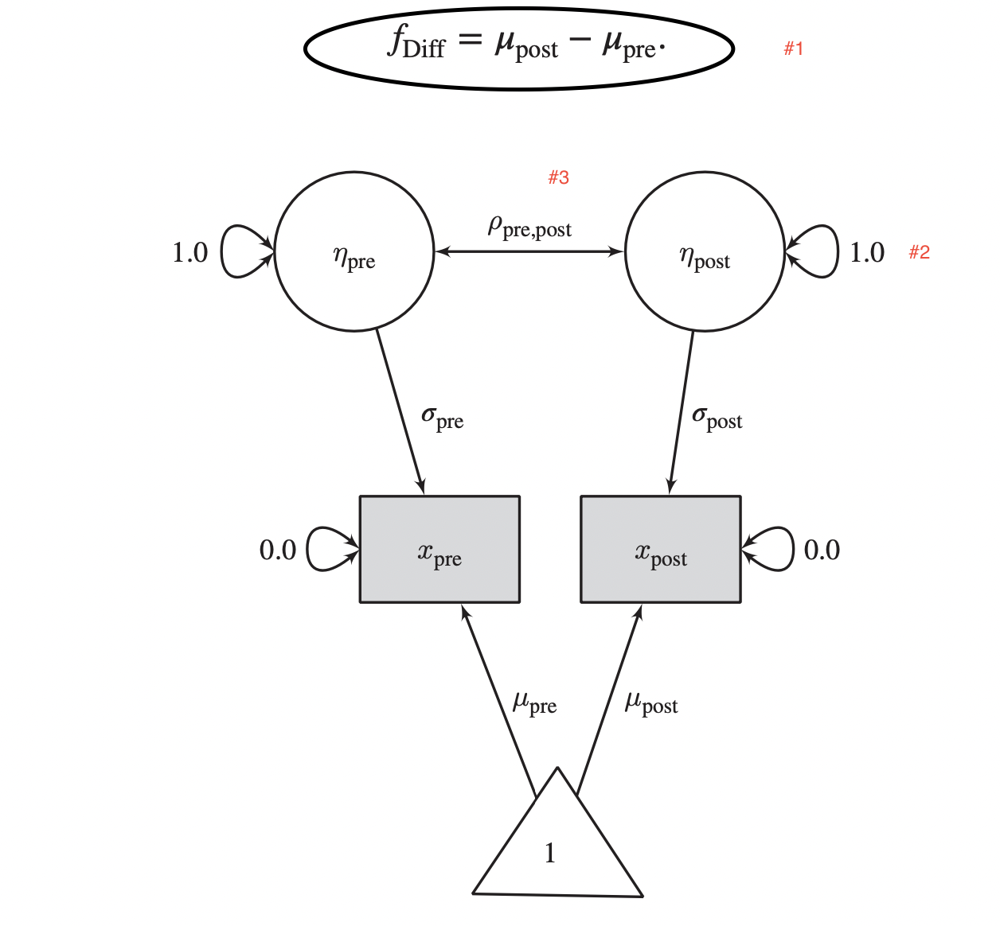
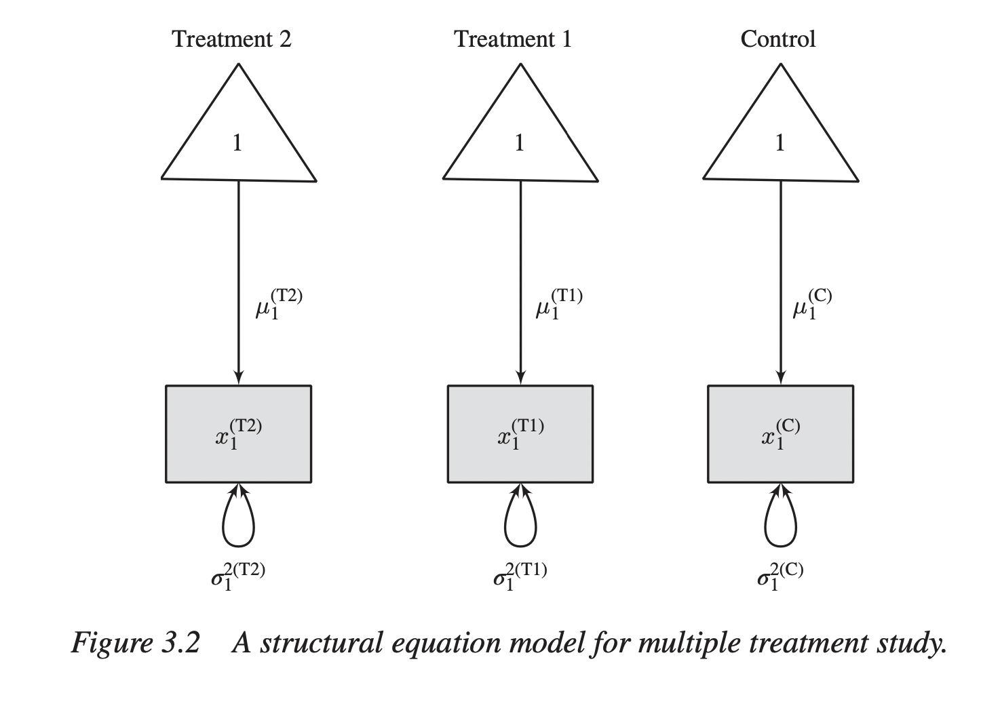
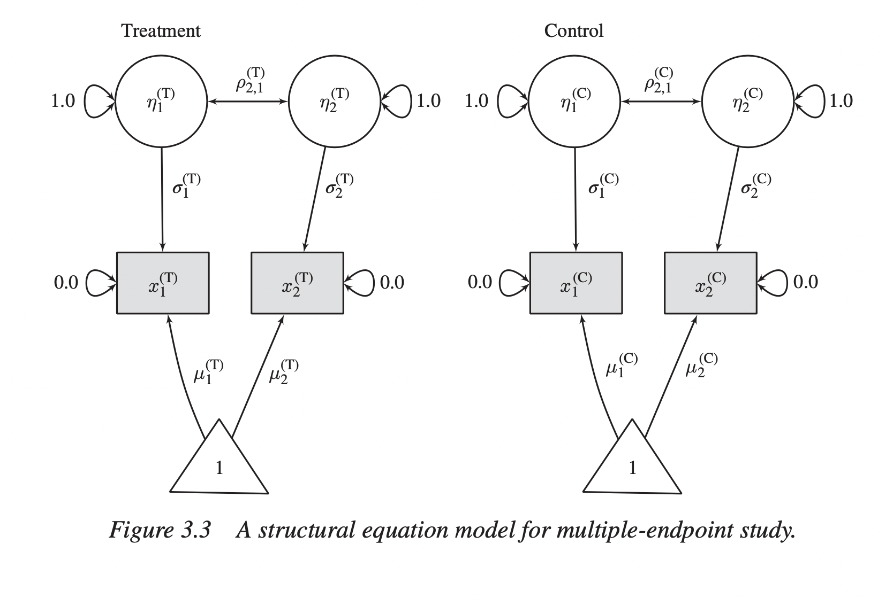

```{r setup, include=FALSE}
knitr::opts_chunk$set(echo = TRUE)
```

## Repeated measures with SINGLE studies

```{r chunk_1}

library(lavaan) # load lavaan first
# input the sample pre and post test scores
# start with a lower matrix

lower = '10
           8 12'
# so 10 and 12 are variances, 8 is the covariance between x_pre and x_post
# get the covariance matrix
covmat = getCov(lower, diag = T, 
                names = c("x_pre", "x_post"))
           
# See how covmat looks like
covmat

# Input the means

sample_mean = c(10, 13)

# Input the sample size
sample_size = 50


```
# With the above data, we will fit the following Structural Equation Model




So, from the figure, we have

1. eta_pre = latent variable for pre score for x
2. eta_post = latent variable for post score for x
3. both eta_pre and eta_post are fixed at 1.0 for their variance
4. rho_pre_post is the correlation between eta_pre and eta_post
5. eta_pre LOADS on x_pre with sigma_pre (which means following path tracing rules, we will say that explained variance of x_pre is sigma_pre^2)
6. similarly, eta_post LOADS on x_post with sigma_post
7. The triangle of 1 is the means latent variable and 
8. mu_pre is the mean of x_pre 
9. mu_post is the mean of x_post
10. As can be seen in the top of the figure, true effect size in this case f_dff = mu_post - mu_pre
11. x_pre and x_post HAVE NO OTHER source of variance, hence their unexplained variance is 0!

In the following code, we will provide lavaan the formula


```{r chunk 2}

model01 = '
  eta_pre =~ sigma_pre * x_pre
  eta_post =~ sigma_post * x_post
  eta_pre ~~ rho_p_p * eta_post
  x_pre ~~ 0 * x_pre
  x_post ~~ 0 * x_post
  x_pre ~ m_pre * 1
  x_post ~ m_post * 1
  f_diff := m_post - m_pre
  smd_pre := (m_post - m_pre) / sigma_pre'

# Let's fit the model

fit01 = cfa(model01, 
            sample.cov = covmat,
            sample.mean = sample_mean,
            sample.nobs = sample_size,
            std.lv = T,
            sample.cov.rescale = F)

# find out the summary of the model

summary(fit01)

# parameter estimates

parameterEstimates(fit01)[c(12,13,14), -c(1,2,3)]


```

Let's assume that the facctor loading or explained variance of the x variables are SAME for pre and post, then we re-write the code as follows:

```{r chunk 3}


model02 = '
  eta_pre =~ sigma * x_pre
  eta_post =~ sigma * x_post
  eta_pre ~~ rho_p_p * eta_post
  x_pre ~~ 0 * x_pre
  x_post ~~ 0 * x_post
  x_pre ~ m_pre * 1
  x_post ~ m_post * 1
  f_diff := m_post - m_pre
  smd_common := (m_post - m_pre) / sigma'

# Let's fit the model

fit02 = cfa(model02, 
            sample.cov = covmat,
            sample.mean = sample_mean,
            sample.nobs = sample_size,
            std.lv = T,
            sample.cov.rescale = F)

# find out the summary of the model

summary(fit02)

# parameter estimates

parameterEstimates(fit02)[c(12,13,14), -c(1,2,3)]

```

## What has changed?

1. We now have a different model, model02
2. We have a common sigma, ("sigma")
3. The SMD is now common, based on the common sigma
4. The fit is given a new name, fit02

Let's run this model and see what we get.
Comparing the previous model with this one, we see

1. the true difference remains the same, i.e., 3.0
2. The smd_common now is smaller

## So, what happens when we have more than one treatment group

Say, if we have two interventions and one control, what shall we do?

Let's say we have one control and two treatments


This is slightly more complex, so:

1. There are NO latent variables here, only latent means!
2. Three manifest variables x_1_c, x_1_t1, x_1_t2
3. Each x variable has its corresponding variance, var_c, var_t1, var_t2
4. Each x variable ALSO has its latent means that load on these variables, so
5. mu_c, mu_t1, and mu_t2

Let's say we have three variances and three means, so see the following code:

```{r chunk 4}

# variance for control
var_c = matrix(10, dimnames = list("x", "x"))
# this creates a matrix of one unit with value 10
# variance for trt 1
var_t1 = matrix(11, dimnames = list("x", "x"))
# variance for trt 2
var_t2 = matrix(12, dimnames = list("x", "x"))
# combine these variances into a list
var_combo = list(var_c, var_t1, var_t2)

# this is how var_combo look like
var_combo
# this is their means
mean_combo = list(5, 7, 9)
# and this is their respective sample size
sampsize = c(50, 52, 53)
# if we say they have HOMOGENEITY of variance but their means differ, then

model03 = 'x ~~ c("s1", "s1", "s1") * x
           x ~ c("m1", "m2", "m3") * 1
           smd_x1 := (m2 - m1) / sqrt(s1)
           smd_x2 := (m3 - m1) / sqrt(s1) '
# as there are no latent variable, we will only fit a structural model

fit03 = sem(model03,
            sample.cov = var_combo,
            sample.mean = mean_combo,
            sample.nobs = sampsize,
            sample.cov.rescale = F)
# obtain free parameters in the model
free_params = fit03@Fit@x
# what do we get?
free_params
# what is the sampling covariance matrix?
samp_vcov = vcov(fit03)
samp_vcov
# calculate multiple effect sizes using delta function
smd_x = fit03@Model@def.function(free_params)
# smd_x
# Calculate the jacobian for defined params

jac = lavaan:::lavJacobianD(func = fit03@Model@def.function, x = x)

# compute the sample vcov
mt_vcov = jac %*% samp_vcov %*% t(jac)

dimnames(mt_vcov) = list(names(smd_x), names(smd_x))

mt_vcov
smd_x
```

## So, what happens if we have multiple ENDPOINT studies?

1. This time, we have TWO groups (control, and treatment), but
2. Treatments were tested in two different times, say t1, and t2
The figure looks like as follows:


Now, we are still in the single study effect measure space, but we see that for BOTH treatment and control groups, there are two time points. So we have:

1. eta_t1: latent variable for time point 1
2. sigma_t1: eta_t1 loads on manifest variable x_t1 at time point t1
3. eta_t1 is standardised so its variance is set at 1.0
4. x_t1 is accounted only by the latent variable so its variance is set at 0
5. mu_t1 is the latent mean for x_t1
6. eta_t2: latent variable for time point 2
7. sigma_t2: loads on manifest variable x_t2
8. x_t2: manifest variable for time point t2
9. mu_t2: mean for x_t2 at time point t2
10. eta_c1: lv for control at time point t1
11. sigma_c1: eta_c1 loads on x_c1 with sigma_c1
12. x_c1: control value at t1
13. mu_c1: latent mean for x_c1
14. eta_c2: lv for control at t2
15. sigma_c2: eta_c2 loads on to x_c2
16. x_c2: x variable for control at T2
17. mu_c2: latent mean for x_c2 at T2

So, we see for the simple case of one treatment and one control group at two time points, we will need to consider 17 variables. 

Let's set up the codes:

```{r chunk5}

# cov matrix for control with treatment at T1
lower_c_t1 = '11
               5 10'
cov_c_t1 = getCov(lower_c_t1,
                  diag = T,
                  names = c("x1", "x2"))
# same thing for control with treatment at T2

lower_c_t2 = '12
               6 11'
cov_c_t2 = getCov(lower_c_t2,
                  diag = T,
                  names = c("x1", "x2"))

# create a list of these two matrices

cov_both = list(cov_c_t1, cov_c_t2)

# Create lists for means for two groups
means_both = list(c(10, 11), c(12, 13))
# Create lists for sample sizes
ss = c(50, 50)
# Assume homogeneity of variances
# set up our models
model04 = 'eta_t1 =~ c("sigma_1", "sigma_1")  * x1 
           
           eta_t2 =~ c(sigma_2, sigma_2) * t2
           
           eta_t1 ~~ c("r", "r") * eta_t2
           '

# fit04 = sem(model04,
          #  sample.cov = cov_both,
           # sample.mean = means_both,
            #sample.nobs = ss,
            #std.lv = T,
            #sample.cov.rescale = F)
 # free params
#free_params = fit04@Fit@x

```


```{r}
cov_both

```

## Univariate meta analysis

```{r chunk06}
# first load the library
library(metaSEM)
```

```{r chunk 07}
# 8 studies were selected from a meta analysis by Mak (citation)
# risk of AF between bip/non-bip users
# effect measure was Odds Ratio
# this is an artifical data (somewhat)
# Load the data
library(tidyverse) # this library helps in visualisation etc

data("Mak09")
# display head
head(Mak09) # see they mixed RCTs and Obs studies
table(Mak09$type) # 3 observational studies, 5 RCTs
# All MA in this framework needs for each study a yi and a variance vi
# list the yi and vi
yis = Mak09 %>%
  select(yi,vi) %>%
  head()
yis

# Once you get the yis and vis, get the random effects model

mak_rand = meta(y = yi, v = vi, 
                data = Mak09)
summary(mak_rand)

```

## Note the following:
1. OpenMx status 0 tells us that optimisation is OK
2. Test of homogeneity Q = 7.16, p = 0.41
3. I^2 = 0
4. These tell us that heterogeneity is not a problem with this data set
5. The estimates returned by fixed effects and random effects will be similar if not identical

## Fixed effects model

```{r chunk08}

mak_fixed = meta(y = yi,  v = vi,
                 data = Mak09,
                 RE.constraints = 0)
summary(mak_fixed)
# Get the estimates

estimates = summary(mak_fixed)$coefficients
# then
exp(estimates)
#estimates

```

## So, here:
* Results are very similar to what we have obtained in the random effects model (expected)
* We added the RE.constraints, i.e., tau square to 0 
* This indicates we have fixed the tau-square to 0
* RE = random effects

## Mixed effects models
Here, the idea is similar to meta-regression or sensitivity analyses
Here we take
* Another study
* In this study they studied correlation between organisational commitment and job performance

```{r chunk08}

data("Jaramillo05")
head(Jaramillo05) # shows the variables
# effect size = r
# variance = r_v

jarmeta = meta(y = r, v = r_v, 
     data = Jaramillo05)
summary(jarmeta)

jarfixed = meta(y = r, v = r_v, 
     data = Jaramillo05,
     RE.constraints = 0)
summary(jarfixed)
```

## Multivariate meta analyses

* When in a study more than one effect size is reported
* We believe that the two effect sizes are correlated with each other

```{r chunk09}
# load the data
data(BCG)
head(BCG)
# effect sizes: ln_Odd_V (Odds of vaccinated group), ln_Odd_NV Odds of nonvaccinated group
# cov_v_nv = 0
bcg_rand = meta(y = cbind(ln_Odd_V, ln_Odd_NV),
                v = cbind(v_ln_Odd_V, cov_V_NV, v_ln_Odd_NV),
                data = BCG,
                model.name = "Random Effects")
summary(bcg_rand)

## Equal intercepts

bcg_eq = meta(y = cbind(ln_Odd_V, ln_Odd_NV),
                v = cbind(v_ln_Odd_V, cov_V_NV, v_ln_Odd_NV),
                data = BCG,
                intercept.constraints = c("0 * Intercept", "0 * Intercept"),
                model.name = "Equal Intercepts")
summary(bcg_eq)

# plot
plot(bcg1)

```
```{r chunk10}
data("wvs94a")
head(wvs94a)
# Random effects model
values_rand = meta(y = cbind(lifesat, lifecon),
                   v = cbind(lifesat_var, inter_cov, lifecon_var),
                   data = wvs94a,
                   model.name = "Random effects")
summary(values_rand)

tau_squared = vec2symMat(coef(values_rand, select = "random"))
tau_squared

# convert the covariance matrix to correlation matrix
cov2cor(tau_squared)

# Plot the two variables together
plot(values_rand,
     axis.labels = c("life satisfaction", "life control"),
     study.ellipse.plot = F)

# Run a mixed effeccts model with GNP as moderator
wvs_mixed = meta(y = cbind(lifesat, lifecon),
                 v = cbind(lifesat_var, inter_cov, lifecon_var),
                 x = scale(gnp/10000, scale = F),
                 data = wvs94a,
                 model.name = "GNP moderator")
summary(wvs_mixed)
```

## Three level meta analysis

What happens when the conditional covariance matrix is NOT known or cannot be reliably estimated from the studies?

Three level meta analyses to handle dependent effect sizes
1. Level 1: authors
2. Level 2: proposals
3. Level 3: studies
4. effect size: logOR
5. v: v
6. Cluster: cluster effect at level 3
7. Covariates: Year, Fellowship/Grants, Discipline, Country
8. Data: Bornmann07

```{r chunk11}
# Inspect the data
head(Bornmann07)
tail(Bornmann07)
# so there are 21 clusters
# number of clusters per study
t(aggregate(logOR ~ Cluster, data = Bornmann07, FUN = length))
# some clusters have ONE study, some have two studies, some have 9 studies!
# the function to fit three level MA is meta3
three_level = meta3(y = logOR, 
                    v = v,
                    cluster = Cluster,
                    data = Bornmann07,
                    model.name = "three levels",
                    intervals.type = "LB")
summary(three_level)
```
## Meta analytic structural equation modelling

Meta analysis of correlatioon matrix
Two steps:
1. Step 1: Pool correlation matrices
2. Step 2: Analyse the pooled correlation matrix

```{r chunk12}

# fit a two stage TSSEM
# get the data
data("Digman97")
# First two correlation matrices
Digman97$data[1:2]
# First two sample sizes
Digman97$n[1:2]
# conduct fixed effects tssem
fixed_effects_tssem = tssem1(Digman97$data, 
                             Digman97$n,
                             method = "FEM")
summary(fixed_effects_tssem)
# Extract the pooled correlation matrix
coef(fixed_effects_tssem)
# Group the studies into clusters as fixed effects model is no good
# Random effects model
rand_eff_model = tssem1(Digman97$data, 
                        Digman97$n,
                        method = "REM",
                        RE.type = "Diag")
summary(rand_eff_model)
```


